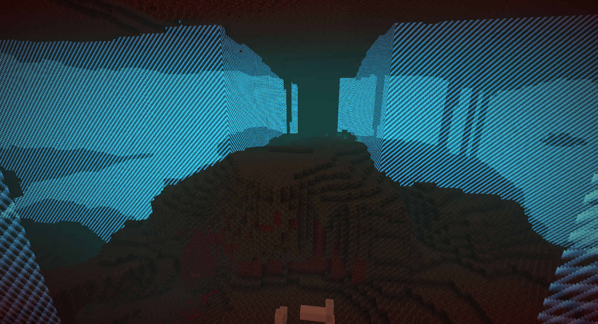
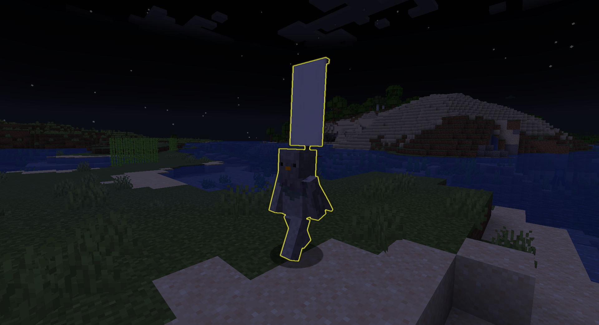

QuadWars is a plugin allowing four teams to compete in a Minecraft world. Each team gets a
quadrant of the world to build and gather resources in undisturbed, and when it's time for
battle can attack in the world they have been preparing.

# Features

## Separate Team World Borders

Each team gets their own world border during the prep phase. This keeps teams from interfering with
each other: flying machines won't travel across, cannons can't remotely kill players, and
attempting to stray outside the world border will result in damage that increases as you get
further out.

## Self-Service Team Selection

 → 

Don't want to spend time assigning players to teams? Players can join a team themselves using the
`/jointeam` command. The option to have teams assigned by an op is available too by denying a
permission.

## Goal Flexibility

By default, the plugin config will assume that for your battle you will want to do a last team
standing game and switch on hardcore, but it's not required. If you want to do capture the flag
or another style of event that doesn't need hardcore, you can turn it off.

## Phases

The plugin has three main phases:

1. The pregame phase allows players to pick out teams or an op to assign players to teams. It also
   gives the op time to prepare the game worlds if needed.

2. The prep phase sends teams into their quadrants, where they can explore, build, gather resources,
   and do anything else the game lets them. The plugin creates a world border for each team to keep
   them inside their quadrant. The length of this is up to you, it can be hours if you want a
   one-day game or weeks if you want a long-term game.

3. The battle phase is where the teams fight each other. The plugin disables its per team world
   borders, and enables PvP and hardcore. Teams can attack enter each other's quadrants and attack
   their bases and players. The game ends when only one team is left.

## Integrations

* *Floodgate:* QuadWars will utilize Bedrock's forms feature to show players a team selection UI
  if they do not already have a team. No need to type on a gamepad!
* *Apollo (Lunar Client):* If you have [Apollo](https://modrinth.com/plugin/lunar-client-apollo)
  installed, QuadWars can utilize some of the extra features available in Lunar Client. Lunar
  allows servers to render more than one world border at a time, meaning QuadWars can render all
  four team borders, instead of just the one for your own team. QuadWars will also have Lunar
  show a logout warning during the battle phase.
* *Anything using Scoreboard Teams:* QuadWars
  uses [Vanilla's Teams](https://minecraft.wiki/w/Scoreboard#Teams), meaning anything else that
  can read Scoreboard Teams will work with QuadWars.

# Admin Usage

## Permissions

Admin functions of the plugin are gated by `quadwars.gamemaster`. This gives access to all admin
commands. The player command provided by the plugin, `/jointeam`, is gated by
`quadwars.player.jointeam`, which is granted by default.

## Admin Commands

### `/qwtransition`

This moves the game to the next phase.

### `/qwsetphase <phase>`

This sets the game to a specific phase. The phase can be `PREGAME`, `PREP`, `BATTLE`,
or `POST_GAME`.

### `/worldborder`

QuadWars overrides the built in `/worldborder` command, because it conflicts with the world
borders used for players during the prep phase. Usage is nearly identical to the [vanilla
command](https://minecraft.wiki/w/Commands/worldborder),
but the QuadWars version will sync across dimensions and take coordinate scaling into account.

If you are trying to set the world border during the prep phase, change the config option
`worldBorderSize`, and restart the server.

### `/qwgetphase`

This gets the current phase of the game the plugin has set.

### Useful Vanilla Commands

#### `/team`

This allows admin management of
teams. [See the Minecraft wiki for usage](https://minecraft.wiki/w/Commands/team).

**Do not use
the add or remove commands, they will break the plugin.** Removing a team not managed by the
plugin is ok and encouraged, since Minecraft only allows entities to be in one team.

If changing a player's team during the prep phase, teleport them to the lobby world first,
change their team, and then teleport them to the new team's quadrant. If you don't, the player
will start taking world border damage when you change their team.

## Suggestions for resolving a stalemate

If you get to the battle phase and decide it is taking too long, here are some recommendations
to encourage teams to make a move:

### Use the glowing effect

If teams are having trouble finding each other, you can use the glowing effect to make players
much more visible. Players will even be colored with their team color set in the config. To do
this, run `/effect give @a minecraft:glowing <time>`, where time is how long you want the effect
to last, or `infinite` if you want it to last for the rest of the game.

### Make a bonus chest

If you want to give players a reason to move, you can create a bonus chest with valuable items
and give out the location to everyone. This may encourage players to move to the location and
fight for the chest's content.

### Use the world border

Once you are in battle mode, the plugin unlocks its `/worldborder` command. It is a
reimplementation of the vanilla one, but has the advantage of being synced across dimensions.
You mainly would want to use `/worldborder set <size> <time>` or `/worldborder add -<size>
<time>`. When doing this, **use a
calculator to make sure you don't exceed a velocity of 5.612 m/s**. This is the maximum sprint
speed of a player, and you will butcher your players if you exceed it.

### Use spread players

If you want to force everyone to move, you can use
the [`/spreadplayers`](https://minecraft.wiki/w/Commands/spreadplayers) command to move teams
to a random spot within a certain radius using
`spreadplayers 
 <spreadDistance> <maxRange> true @a`

# Things players should know

* Players can send messages to just their team using Vanilla's `/teammsg` (aliased to `/tm`)
  command.
* Avoid building nether portals near the inner edges of the world border. It is possible for the
  game to place the destination portal outside the team's world border, causing a potentially
  deadly scenario where getting your items back can be near impossible.
* Vanilla allows players to see their teammates when using invisibility potions and prevents
  friendly fire.
* Players can join a team using `/jointeam`. Players connected using Floodgate+Geyser will get a
  popup to select a team. Once a team is selected, they can not change it themselves.

# Compatibility

QuadWars was built for Minecraft: Java Edition version 1.20.6, running Paper or one of its
forks. Other versions of Minecraft may work, but are untested. (If a newer version has come out,
please let me know how it goes!). Upstreams of Paper (Bukkit & Spigot) will *not* work, as this
plugin utilizes the expanded API provided by Paper.

QuadWars should integrate well with any plugin that also utilizes the Scoreboard Team API, as
long as none of them create new teams. Minecraft only allows entities to be in one team,
so any other plugin that adds entities to a team will not work with QuadWars.

# bStats

This plugin uses [bStats](https://bstats.org/), the common service used by most plugins and server
software, to keep track of basic stats. You can opt out of bStats for all plugins and your server
software by editing the `plugins/bStats/config.yml` file that is generated on the server's first
launch.